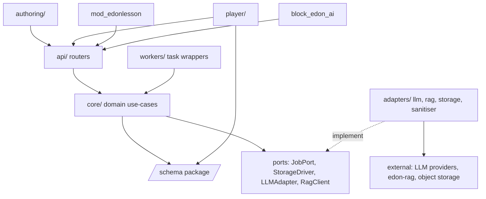
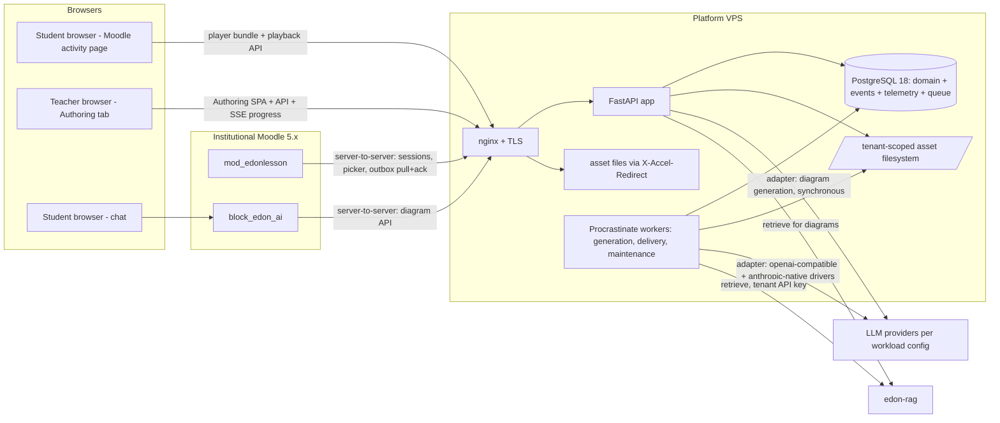
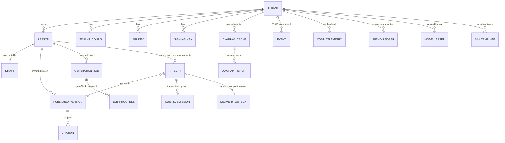

# Architecture Spine — e-DON Lesson Studio

## Design Paradigm

**Hexagonal modular monolith.** One backend deployable (FastAPI app) plus worker processes, all importing a single framework-free `core` package; every external system sits behind a port with swappable adapters (LLM adapter, edon-rag client, StorageDriver, LMS-agnostic delivery outbox). The generation pipeline is **pipes-and-filters** defined as config data. The Player is a **registry-based shell**: block renderers, delivery source, and narration provider are registered implementations of small interfaces — the V3 seams *are* these registries. Layer map: `backend/src/edon/core` (domain — imports nothing from `api/`, `adapters/`, `workers/`), `adapters/` (ports' implementations), `api/` (FastAPI routers, thin), `workers/` (Procrastinate task wrappers, thin).

## Invariants & Rules

### AD-1 — One backend deployable; framework-free core
- **Binds:** all backend code
- **Prevents:** service sprawl on a single VPS; domain logic welded to FastAPI/Procrastinate so a later split or swap becomes a rewrite
- **Rule:** exactly one backend application + worker processes importing the same `core` package. `core` imports no web framework, no queue library, no vendor SDK; routers and task definitions stay thin (parse → call use-case → shape response). New capabilities are new core modules behind the same app, not new services. [ADOPTED: project-context §2 deploy envelope]

### AD-2 — The schema package is the only content contract
- **Binds:** /schema, backend pipeline, Player, Authoring, all future renderers (FR-1..3, I-3)
- **Prevents:** generator and renderers drifting to incompatible Lesson Script dialects
- **Rule:** JSON Schema 2020-12 documents in `/schema` are the single source of truth, versioned `MAJOR.MINOR` — **minor = additive only** (new optional fields, new Block types; players ignore unknowns per FR-2; reserved V3 metadata like adaptive branching lands as additive optional fields, so it is non-precluded by construction), **major = breaking**. The cannot-play state applies only to scripts *newer* than the player build; players never drop renderer support for a shipped major — published lessons stay playable forever (I-3). Lesson metadata includes `curriculumRef: {value, source: "pipeline"|"teacher"}` — pipeline-derived, Teacher-correctable in review (UX handoff item 12). Backend Pydantic models are mirrors, proven equivalent in CI against the shared fixture corpus (which includes unknown-block and future-version fixtures); the Player consumes the package at build/CI time (fixtures + docs — its renderers are built against the schema package alone, per FR-3). No Lesson Script persists without passing the package validator. Schema changes require a version bump + migration/compatibility note in `/schema/docs`. Two pinned payload facts independent builders would fork on: (1) the citation object's **required** fields are only the retrieval-guaranteed set — `sourceChunkId`, `documentTitle`, `excerpt`; `locator`/`documentId`/`tags` are optional (WI-RAG-1 fallback must still validate; the fixture corpus includes a no-locator citation); (2) every heavy-asset reference in the script carries `transferSize` (bytes), populated at assemble/freeze — tap-to-load labels and the Constrained ceiling read only that field.

### AD-3 — All model access through the one adapter; identity-free by type
- **Binds:** every LLM call (project-context §3 [HARD]; NFR-9)
- **Prevents:** vendor lock-in, hardcoded model strings, PII leakage to providers, untelemetered spend
- **Rule:** consumers call one async OpenAI-compatible interface keyed by workload (`lesson_generation`, `simulation_generation`, `diagram_generation`; the `embeddings` key exists in config for completeness but the platform never calls it — embeddings stay inside edon-rag); provider/model/params come from per-workload config. Internally exactly two drivers: `openai-compatible` (base_url per provider: OpenAI, Gemini compat, vLLM, OpenRouter) and `anthropic-native` (translating — Anthropic's compat layer is test-grade and drops structured outputs/caching; verified 2026-07-17). The adapter request type has **no identity fields**; it carries a mandatory `governance_ref = (action_type, accounting_ref)` — still identity-free — so reservation keys on `action_type` (e.g. `lesson_generation` vs `block_regeneration` sharing one workload) and only the telemetry writer resolves `accounting_ref` to tenant/pseudonym. Cost Telemetry and governance (AD-8) execute in this call path — there is no ungoverned way to spend.

### AD-4 — Transactional enqueue
- **Binds:** Generation Jobs, delivery outbox, every job that must not be lost (FR-8, SM-3)
- **Prevents:** ghost jobs and lost writebacks when a process dies between write and enqueue
- **Rule:** jobs run on Procrastinate using the platform PostgreSQL; any job whose loss violates a requirement is enqueued **in the same transaction** as the domain write it serves. Queues: `generation`, `delivery`, `maintenance`. Domain code calls a core port (`JobPort`); only `workers/` imports Procrastinate.

### AD-5 — Data ownership and immutability at the database
- **Binds:** all persistence (FR-11, I-3, NFR-4)
- **Prevents:** two owners of one entity; mutation of Published Versions by convention-drift
- **Rule:** PostgreSQL is the system of record; Lesson Scripts are JSONB validated before every write. `published_versions` is immutable — the app role has no UPDATE/DELETE grant. One mutable Draft per Lesson with a monotonic `revision` for optimistic concurrency (`If-Match`; mismatch = 409). Citations live embedded in the script (self-containment) *and* projected to a query table; the embedded copy is authoritative. Publishing is one transaction: revalidate → pre-publish checks → asset freeze → version insert → event.

### AD-6 — TenantContext law
- **Binds:** every query, cache key, asset path, log line, quota (I-4 [HARD])
- **Prevents:** any cross-tenant access path, including accidental ones
- **Rule:** no data access without a `TenantContext` resolved from the credential (never from request params). Repositories require it; the asset-path and cache-key helpers require it; logging middleware binds `tenant_id` + pseudonym to every line. Defense-in-depth: RLS on every tenant-owned table via per-request session GUC; a table without an RLS policy fails migration CI. Operator access is a separate router + separate DB role, explicit `tenant_id` parameter, audited `operator_action` event — the only sanctioned cross-tenant path.

### AD-7 — Writes through core use-cases; events with their writes
- **Binds:** all state mutation; FR-27
- **Prevents:** side-door mutations that skip validation, events, or governance; event/state divergence
- **Rule:** every mutation goes through a core use-case service; FR-27 Structured Events are inserted in the same transaction as the state they record. The event taxonomy is closed and canonical: the FR-27 list + the UX-approved extensions (`diagram_review_completed`, `diagram_invalidated`) + three architecture additions pending sign-off (`operator_action`, `cost_alert`, `writeback_overdue`); Regeneration emits the `lesson_generated`/`generation_failed` family with `scope: lesson|block` detail. New event types require a PRD/architecture note, not ad-hoc strings.

### AD-8 — One governance subsystem, reserve → settle
- **Binds:** every LLM-spending action (FR-21, FR-26, I-1; V3 seam d)
- **Prevents:** per-feature quota forks; UI-only enforcement; unmetered spend paths
- **Rule:** quotas (countable), rate limits (temporal), and budgets (monetary, calendar-month) are policies over one `action_type` vocabulary, enforced at **two named points**: (1) a pre-enqueue/pre-request governance check inside the intake use-case, returning machine codes `budget_paused | quota_exhausted | rate_limited` (this is what UIs render); (2) the adapter-path reserve→settle as backstop — reserve before the call, settle with real telemetry cost after (failed-job spend settles — A-29). A job already queued when the budget exhausts fails fast at fetch with `budget_paused` (no repair retry, no spend). The Authoring/playback bootstrap responses carry a `governance_state` field the banners read. Cache hits charge nothing (FR-21). Exhaustion semantics are OQ-9 verbatim: generation intake pauses with explicit notice, diagrams go cache-only, replay never blocked. Default per-tenant generation concurrency is **1**, which keeps the budget overrun bound at exactly one in-flight job (A-29's letter); raising the concurrency raises the bound correspondingly and is a flagged config decision. Future generation types are policy rows, never new subsystems.

### AD-9 — Storage law and publish freeze
- **Binds:** all binary assets (project-context §2; V3 seam e)
- **Prevents:** published lessons breaking when library assets change; tenant path leaks; storage-vendor lock-in
- **Rule:** all asset IO through the `StorageDriver` port (launch: VPS filesystem + nginx `X-Accel-Redirect` after app authz; S3-compatible driver is the swap). Every key starts `tenants/{tenant_id}/`. Lesson Scripts reference assets by **stable asset id** (`asset://{asset_id}`), resolved to URLs at delivery via the Draft's live paths or the version's frozen manifest — so publishing never alters the script the Teacher previewed (FR-9). Publishing freezes every referenced asset into the immutable `lessons/{lesson_id}/v{n}/` prefix with a `manifest.json` (hashes, sizes, licence metadata); Published Versions resolve against frozen paths only. Storage keys are machine-safe by rule: user/derived text never becomes a path segment (the diagram cache key is `sha256(normalised_text)` hex); the StorageDriver rejects keys outside `[a-z0-9/_\-.]` or containing `..`. MinIO excluded (AGPL).

### AD-10 — Player composition: three interfaces + a registry
- **Binds:** /player (FR-13/14, FR-2; V3 seams a, b, c)
- **Prevents:** renderers, delivery, and narration hard-wired so V3 becomes a Player rewrite
- **Rule:** (a) `BlockRegistry` maps `block.type` → renderer; unknown types are omitted from sequence and counts — new types (incl. dialogue turns) are registry entries + a schema minor bump. (b) The Player consumes scripts only via `LessonDeliverySource` — MVP `CompleteScriptSource` resolves the full Published Version, and the interface exposes an async block-iterator signature so incremental delivery is a drop-in source, not a Player change (backend-side, streaming is an additive new endpoint). (c) Narration only via `NarrationProvider` (`available/speak/pause/stop/events`); MVP registers `SpeechSynthesisProvider` with the bounded-start watchdog (no audible start ≤ 3 s → Floor transcript rung; WebView-shell browsers lack Web Speech entirely — verified — and land there by detection). (d) Results (view marks, quiz submissions, completion) leave the Player only via `ResultsSink` — MVP `PlatformResultsSink` (playback API + AD-15 outbox semantics); preview mounts a no-op sink, so preview can never write results. No runtime schema validation in the Player (scripts arrive server-validated). Rationale record: ADR-014.

### AD-11 — Embedding and budget contract
- **Binds:** /player build + mod_edonlesson embed (FR-18, FR-22, NFR-2, UX Embedding Contract)
- **Prevents:** the bundle outgrowing the device floor; the embed fighting Moodle pages
- **Rule:** the Player ships as one self-contained IIFE exposing `EdonPlayer.mount(el, opts)`/`unmount`; syntax floor ES2017 (`build.target`/`cssTarget: 'chrome61'`) **plus targeted built-in polyfills inside the core budget** (`globalThis`, `queueMicrotask`, `Promise.finally`, and whatever a compat-lint gate flags — transpilation alone does not supply missing built-ins on 2017 engines), a browserslist compat-lint in CI, and one real old-engine smoke (pre-launch hardening item — the throttled CI profile exercises modern Chromium only). Chunk/asset URL resolution must not use `import.meta.url` (Vite 8 no longer polyfills it in IIFE output) — the bundle captures its own base URL via `document.currentScript` at init. Styles namespaced `edon-p-*`, container-scoped, no global resets; in-page mount (no iframe at Player level — the Embedding Contract's scroll/height rules). All budgets live in one repo-root `budgets.json` — its own JSON Schema lives in `/schema`, every value in **bytes** (or ms where temporal), consumed by exactly four readers: player CI, pipeline validators, the ingest CLI, and the simulation check harness (AD-12's budgets are entries in it, not constants). Launch values: core ≤ 150 kB gzip (hard fail); lazy chunks — `model3d` ≤ 220 kB gzip, `simulation` ≤ 60 kB, `showcase` ≤ 300 kB (post-first-paint, Showcase tier only); assets — glTF ≤ 5 MB transfer (≤ 3 MB preferred at selection), posters ≤ 60 kB, diagram SVG ≤ 150 kB; perceived floor — title + first Slide text ≤ 5 s on the CI low-spec profile (Playwright + CDP CPU 6× + 400 kbps/400 ms RTT). Showcase detection is feature-based, demote-when-unsure (WebGL ∧ deviceMemory ≥ 4 ∧ hardwareConcurrency ≥ 4 ∧ effectiveType = 4g ∧ ¬saveData); at most one heavy Block live at a time. **Constrained-tier predicate** (UX "definition architecture-owned"): low device class = `deviceMemory ≤ 2` or undefined; for the low class the per-asset load ceiling is half the standard cap (glTF > 2.5 MB ⇒ poster-only Constrained behavior), and any heavy-asset load failure or timeout routes that Block to Constrained behavior regardless of tier. The CI low-spec profile is CPU-throttled (6×), network-shaped (400 kbps/400 ms RTT), **and memory-capped** (browser container limited to ~1.5 GB via cgroup, per project-context §7 "constrained memory").

### AD-12 — Simulation sandbox law
- **Binds:** Simulation Blocks end to end (FR-17 [HARD]; OQ-5)
- **Prevents:** sandbox escape; free-code and template modes forking the schema or Player
- **Rule:** `iframe sandbox="allow-scripts"` (never `allow-same-origin`), srcdoc-injected CSP `default-src 'none'`, communication only via postMessage protocol v1 (documented in /schema; `sim:hello/host:init/sim:ready/sim:state/sim:error/host:set-param`), 10 s readiness watchdog → Poster fallback. The protocol document also pins what independent builders would fork on: the param **descriptor** array in the Block payload (`[{id, label, type, min, max, step, default}]`), single-param `host:set-param {id, value}`, the mandatory `sim:state {params}` echo after set-param (check-4's pass criterion), and the `data-edon-param="{id}"` DOM marker the keyboard-operability check asserts — generation prompts and template guidelines are *derived from* that document. Dual mode in the schema: `mode: "template" | "freecode"` with `templateId`/`bundleRef` payload fields (camelCase per the casing convention), identical sandbox + protocol for both — the OQ-5 ship choice is config. Pre-publish checks (A-35 extended, headless Chromium server-side): loads clean, ready in time, params present **and keyboard-operable** (native controls), responds to set-param, resource budget (≤ 1.5 MB, heap ≤ 128 MB, no > 1 s main-thread task). Any failure blocks publish with the per-Block reason.

### AD-13 — The sanitisation gate
- **Binds:** every LLM-derived SVG, both sides (FR-20 [HARD]; UX item 15)
- **Prevents:** unsanitised SVG reaching storage or a renderer; the sanitiser stripping accessibility
- **Rule:** one server-side allowlist sanitiser (defusedxml-parsed, tag+attribute allowlist; strips scripts, event handlers, `foreignObject`, external references; rejects what cannot conform) is the only path into storage — Mermaid or any intermediate grants no exemption. The allowlist **preserves** `<title>`, `<desc>`, `role="img"`, `aria-label`, `aria-labelledby`. The same pass runs the diagram label-legibility check (font-size/viewBox math at 360 px). Client-side DOMPurify (SVG profile) at render is defense-in-depth only, never the gate.

### AD-14 — Identity, sessions, pseudonyms
- **Binds:** all authentication + all telemetry identity (FR-24, FR-29, NFR-9)
- **Prevents:** credential sprawl; PII spread; un-rotatable secrets
- **Rule:** exactly five credential kinds in MVP (ADR-009) — adding a kind (e.g. LTI 1.3 AGS later) requires an ADR: tenant API keys (hashed, two concurrently valid), Launch Tokens (JWT HS256 per-tenant secret, 120 s, single-use `jti`, URL fragment), Authoring Sessions (HttpOnly cookie, 8 h absolute, T-15 min warning, relaunch-into-same-Draft), Playback Session tokens (opaque, 24 h, lesson+attempt-scoped), and **Operator credentials** (named per-operator keys, hashed, CLI-issued, dual-valid for rotation, valid only on the `/operator/*` router, every use audited — AD-6's carve-out). No standalone login exists; dev/staging use a dev-only token-minting CLI on the same JWT code path (disabled in prod config), so pre-Moodle epics are testable. `user_pseudonym = HMAC-SHA256(per-tenant salt, lms_user_id)` everywhere; the raw LMS id lives only in the identity module, session/attempt tables, and delivery outbox (Moodle needs it). All numeric lifetimes are config with these defaults.

### AD-15 — Attempt unit and scoring
- **Binds:** Player, attempts, gradebook (FR-15, FR-23, OQ-15; UX handoff items 11/17)
- **Prevents:** attempt semantics diverging between Player, backend, and Moodle; double-spent attempts
- **Rule:** an attempt = one full Lesson run pinned to one Published Version; attempts, limits, and completion are scoped to **`(lesson_id, activity_ref)`** — "per-Lesson" holds within one activity context, so the same Lesson placed in two activities never cross-blocks (cross-activity aggregation is a reporting concern, not attempt state). Consumed only at first Quiz submission (no-quiz lessons: unlimited runs); reload re-attaches to the open attempt (server-persisted resume state) and never consumes; retake is explicit, post-completion, loads latest version. **Completion denominator is the player-declared rendered set:** at bootstrap the Player declares (via ResultsSink) the ordered Block ids its registry will render for this attempt; completion = all declared Blocks viewed + all declared Quiz Blocks submitted; omitted Blocks are recorded on the attempt for telemetry; server-side inference of renderability is forbidden (FR-2 makes old players omit new types — the server must never out-know them). Scores are `earned/possible` fractions against the attempt's own version; gradebook grade = max fraction × grademax. Submissions: **exactly one scored submission per (attempt_id, block_id)** — first durable ack wins; the endpoint is idempotent on (attempt, block, uuid) and a later different-uuid submission returns `409 already_submitted` with the recorded result; the client outbox reconciles against `resume`'s per-block submitted state before re-enabling any quiz. Server re-score + persistence + outbox rows commit in **one transaction before ack**; "Saving your score…" only after ack; client localStorage outbox + `sendBeacon` for retries. Non-student sessions are `observer: true`: the Player mounts the no-op sink, and the platform refuses attempt creation and outbox rows for them.

### AD-16 — LMS-agnostic edge
- **Binds:** platform API surface (FR-22..24; V3 seam f)
- **Prevents:** Moodle assumptions leaking into the platform; inbound-connection coupling to institutional hosting
- **Rule:** the platform API speaks only its own nouns (lessons, versions, playback sessions, outbox deliveries, `lms_user_id` as an opaque string); Moodle knowledge (gradelib, completion API, Task API, capabilities) lives exclusively in mod_edonlesson. Grade/completion delivery is **pull + ack-with-status**: the plugin's scheduled task pulls, applies, and acks each delivery `applied | failed {error_code}` — a failed ack emits the platform's `writeback_failure` event, redelivery on the next run emits `writeback_retry` (FR-27 stays honest), and rows aging past the SM-3 window emit `writeback_overdue`. The platform never calls into Moodle. Contracts are the versioned documents in /docs/integrations; changes to them are work items.

### AD-17 — Pipeline as configuration
- **Binds:** generation + regeneration (FR-4..8, FR-10; project-context §7)
- **Prevents:** prompt/stage tuning requiring code releases; partial or uncited Drafts
- **Rule:** stages, prompts, retrieval params, repair policy, and per-Block fan-out concurrency are versioned config (`pipeline.yaml` + prompt files), language-keyed, stable-prefix-ordered for provider prefix caching. Retrieval below the score floor fails the job `ungrounded` (A-5); any stage failure after its one repair retry fails the whole job — no partial Draft ever persists (FR-5). Every stage writes `job_progress` rows (the per-Block assembly showpiece; SSE + poll fallback; absence degrades the card). Block Regeneration re-runs only that Block's stage and replaces it atomically, re-running its validations and (Simulation) checks. **Posters derive deterministically from the content itself** — glTF viewer captures at library ingest, headless captures of the simulation at `sim:ready`, SVG rendered directly — never from an image-generation model (the PRD §8 fence, encoded as a pipeline rule). One text normaliser serves both idempotency fingerprints and diagram cache keys, and it is **one function** — `core/text.py: normalise_key` (Unicode NFC → casefold → whitespace collapse → trim → strip trailing Unicode-`P*` punctuation iteratively), with a shared fixture vector in `/schema` fixtures; consumers import it, CI asserts no second implementation (A-7 resolved). Derived keys are hashed before use as identifiers or paths (AD-9).

### AD-18 — Config over constants
- **Binds:** every tunable policy value (FR-26, A-14)
- **Prevents:** redeploys to change quotas/budgets/flags; magic numbers scattering
- **Rule:** policy values (quotas, rate limits, budgets, token lifetimes, watchdog timeouts, budgets.json) live in platform config files or tenant config rows — never as code constants. Tenant flags (`feature.diagrams`, `feature.simulation_blocks` at minimum) are config rows evaluated at generation intake and playback bootstrap; **flags never alter delivered script content** — the bootstrap response carries the flag map and the Player degrades presentation (flag-off Simulation renders as Poster fallback, A-14 resolved); server-side Block stripping is forbidden (it would shift counts, resume positions, and the completion denominator mid-attempt). `.env.example` stays current (DoD, project-context §7).

### AD-19 — Observability floor
- **Binds:** all services (FR-27, NFR-5, NFR-9)
- **Prevents:** the edon-rag logging gap recurring; retention drift
- **Rule:** structured JSON logs to journald with `tenant_id` + pseudonym bound by middleware (no bare prints); FR-27 events and Cost Telemetry are the analytics substrate, supplemented by domain records (job, attempt, version rows) — every SM (SM-1..SM-5) and counter-metric must be computable from stored platform data alone, with per-Lesson/per-Tenant **cost** computable from telemetry alone (FR-27). The Cost Telemetry row contract is fixed and unit-tested: `tokens_in, tokens_out, computed_cost, tenant_id, user_pseudonym, workload, cache_hit, latency_ms, model_id, request_ref` ([HARD] §3 field set); diagram cache hits emit zero-cost rows (no token fields) at the cache-return path. Retention enforced by the nightly maintenance job from `retention.yaml` (default 12 months, per NFR-9).

### AD-20 — Localisation-ready strings
- **Binds:** Authoring UI, Player chrome, chat card copy, platform-emitted user-facing messages (NFR-8)
- **Prevents:** hardcoded English blocking the localisation roadmap; limit copy with baked-in numbers
- **Rule:** every user-facing string is externalised under a language key (en at launch), enforced by an i18n lint gate in CI (no bare string literals in JSX text positions; no inline user-copy in API response builders); keys follow `surface.component.slug`. Limit/quota copy is templated with values interpolated from tenant config (never hardcoded numbers); Lesson Script text fields carry a language tag; Player content regions set `lang` from it. Rendering split (who resolves keys): the **chat/diagram API returns fully rendered `message` strings** (block_edon_ai stays dumb); **first-party UIs** (Authoring, Player) receive `code + params` and resolve from their own catalogs client-side.

### AD-21 — Diagram channel governance loop
- **Binds:** Diagram Requests end to end (FR-19, FR-21, FR-28; UX rulings 2/10)
- **Prevents:** the one Review-Gate-bypassing channel escaping its governance; invalidated diagrams resurfacing
- **Rule:** flow is fixed: normalise request (AD-17 normaliser) → tenant-scoped cache lookup — a hit returns instantly, emits `diagram_served_from_cache` + a zero-cost telemetry row, and never charges a Rate Limit — → on miss: governance pre-flight (AD-8) → identity-stripped retrieval + mini-tier structured generation → sanitisation gate (AD-13) → store + serve with the verbatim FR-28 label and `altText`/description. The report control enqueues a Teacher review-queue row — pinned shape: `{diagram_id, raw_request_text, normalised_text, svg_asset_ref, report_count, latest_note, requested_at}`; `diagram_id → cache_key` is a stored column, so both actions key on `diagram_id`. **"Mark reviewed"** clears the row (`diagram_review_completed`); **"Mark invalid"** clears the row **and deletes the tenant cache entry** (`diagram_invalidated`) — that diagram is never served again and the next equivalent request regenerates fresh. Both actions are core use-cases the Authoring UI calls (AD-7). Every non-served outcome returns humane, tenant-config-interpolated copy (never a technical error into the chat).

### AD-22 — Playback bootstrap contract
- **Binds:** Player ↔ platform ↔ mod_edonlesson at session start (FR-22..23; UX resume/version-pinning states)
- **Prevents:** the plugin and the Player each compliantly assuming the *other* carries resume/flags/attempt state — leaving reload-restarts and unattributable submissions
- **Rule:** the plugin embeds the Player with exactly `EdonPlayer.mount(el, {scriptUrl, token, locale})` (advanced overrides — source/sink/narration — exist for preview and V3, defaulted otherwise); the Player's first act is `GET /api/v1/playback/bootstrap` (playback-token-authed), which returns the pinned script URL, `attempt` identifiers, `resume` (pinned shape: `open_attempt_id`, `position` as **Block id**, `viewed_block_ids[]`, per-Block `submissions` state, `attempts_used`, `attempt_limit`), `feature_flags`, `governance_state`, `observer`, and `tier_hints`. The session response returned to the plugin is for the plugin's own display only and is never re-serialized into the page. Everything the Player needs beyond the mount options arrives via bootstrap — one carrier, one shape, documented in the integrations contract.

### AD-23 — Draft concurrency law
- **Binds:** Draft mutation from all three writers — Authoring autosave, Block Regeneration jobs, publish (FR-10, FR-11; UX durability rules)
- **Prevents:** regeneration eating in-flight edits, stale local replays clobbering a co-editor, publish freezing content nobody previewed or checked
- **Rule:** (1) Block ids are **stable slot ids minted once at the plan stage**; Regeneration and publish preserve them (citations, view marks, patches, and progress rows all key on them). (2) Regeneration is a normal core-use-case write: it **participates in the revision sequence**, and its completion notification carries `{block_id, new_revision}` so the editor rebases without a spurious 409. (3) 409 recovery is normative: refetch, three-way per-Block rebase, surface true conflicts per Block — never wholesale discard, never blind replay. (4) Locally preserved edits (token-expiry restore) carry their **base revision**; if the server has moved, they stage as visible per-Block proposals (keep-mine / keep-server) — auto-replay is forbidden. (5) Publish requires `If-Match: revision`; pre-publish checks run against that revision-pinned snapshot, and the version-insert transaction asserts the revision is unchanged, else `409 draft_changed_since_review` and the checks re-run. The two-writer scenarios (regen vs edit, admin vs owner, publish vs autosave) are mandatory test-floor cases.

### AD-24 — Progress-stream contract
- **Binds:** pipeline `job_progress` producer ↔ Authoring SSE consumer (FR-8; UX assembly showpiece)
- **Prevents:** producer and consumer inventing incompatible enums/framings, and hot pipeline-config edits silently degrading the flagship progress card
- **Rule:** `job_progress` rows are `(job_id, block_id, stage, state ∈ {pending, running, repaired, done, failed}, display_key, at)` — `block_id` is the plan-minted stable id (AD-23); the SSE stream is **snapshot-then-tail** (full current state on connect, then deltas), with named events `progress` and terminal `job_completed | job_failed`; `display_key` resolves through the AD-20 language catalog, so stage renames in `pipeline.yaml` remain config on both sides. Absence of fine-grained rows degrades the card to the coarse A-8 states — never to a broken stream.

### Dependency direction



`core` never imports `api/`, `adapters/`, or `workers/` — enforced by an import-linter contract in CI.

## Consistency Conventions

| Concern | Convention |
| --- | --- |
| Naming | Python `snake_case`; JS `camelCase`; CSS classes `edon-p-*` (Player) / `edon-a-*` (Authoring); DB tables plural snake; event types past-tense snake (`lesson_published`); API routes `/api/v1/` + snake nouns; ADRs `ADR-NNN-slug.md` |
| Language fence | JavaScript + JSX only in `/player`, `/authoring`, `/schema/js` — **no `.ts`/`.tsx` files anywhere** ([HARD] §2), enforced by a CI lint gate; Python deps managed with `uv` (lockfile committed); JS deps via npm workspaces lockfile |
| Licence gate | CI licence-audit on both lockfiles against the §5 allowlist (MIT/BSD/Apache-2.0/PSF/OFL or compatible) — a non-allowlisted direct or transitive dependency fails CI (mechanises NFR-7) |
| Test & lint toolchain | Backend: pytest + ruff (lint+format). JS: Vitest (unit) + ESLint + Prettier. E2E/CI profiles: Playwright. One toolchain across all stories — per-story tool choices are not open |
| Authoring SPA composition | react-router + thin fetch wrappers over the platform API client; server state via plain hooks/context — no global state library in MVP (revisit only with evidence) |
| API list endpoints | `limit` + opaque `cursor` pagination on every list endpoint (picker, outbox, queue) — no offset pagination |
| IDs, dates, versions | Entity ids UUIDv7; `version_no`/`revision` monotonic ints; timestamps ISO-8601 UTC (`_at` suffix); money `numeric(12,6)` USD; schema version string `"MAJOR.MINOR"` |
| JSON field casing | Lesson Script schema: `camelCase` (matches approved `altText`/`longDescription`); platform API request/response: `snake_case` |
| Error shape | `{"error": {"code": "machine_code", "message": "…", "detail": {…}}}`; stable machine codes; user-facing copy resolved from language keys client-side — raw errors never rendered |
| State mutation | Only via core use-cases (AD-7); optimistic concurrency on Drafts via `revision`; DB transactions own atomicity (no sagas at this scale) |
| Config & secrets | Env vars for infrastructure (12-factor, `.env.example` maintained); YAML/JSON files for pipeline/budgets/retention (versioned in repo); tenant config rows for per-tenant policy; secrets only via env or encrypted tenant-config columns |
| Logging & errors | Structured JSON, journald; `tenant_id` + pseudonym on every line; exceptions → machine-coded errors at the API edge; background failures → events + job retry policy |
| Auth | `Authorization: Bearer` for server-to-server; cookie for Authoring Session; playback bearer for Player calls (AD-14) |
| Migrations | Alembic, reversible, one head; every new tenant-owned table ships its RLS policy in the same migration (CI-checked) |
| Testing floors | Mandatory unit tests: schema validation, sanitiser, governance enforcement, telemetry emission ([HARD] protectors); golden-path pipeline integration on recorded LLM fixtures; Player cross-browser smoke + CI low-spec profile; per-story DoD per project-context §7 |
| Git | Conventional commits; feature branches; no direct pushes to main once CI exists [ADOPTED] |

## Stack

Seed — verified current 2026-07-17; the code owns exact pins once lockfiles exist.

| Name | Version |
| --- | --- |
| Python | 3.12 [ADOPTED] |
| FastAPI / uvicorn | 0.139.x / 0.51.x |
| Pydantic | 2.13.x |
| SQLAlchemy / Alembic | 2.0.51 / 1.18.x |
| Procrastinate | 3.9.x |
| PostgreSQL | 18.x |
| jsonschema (py) | 4.26.x |
| openai SDK (adapter internals only) | 2.46.x |
| httpx | 0.28.x (release-frozen upstream; accepted, flagged) |
| Playwright (py + node) | 1.61.x |
| Node | ≥ 20 LTS [ADOPTED]; pin active LTS at cold-start |
| React / react-dom | 19.2.x (Authoring + Player; Preact swap is a recorded stakeholder option) |
| Vite | 8.1.x (Authoring SPA; Player via lib-mode IIFE, target `chrome61`) |
| Three.js | 0.185.x (r185), lazy `model3d` chunk only |
| @gltf-transform (CLI + SDK) | 4.4.x (MIT at the pinned version — early-v4 PPL relicensing was reverted; licence re-verified at every upgrade by the licence-audit gate) |
| defusedxml / lxml | current (PSF-2.0 / BSD — sanitiser internals) |
| anthropic SDK | current (adapter-internal, `anthropic-native` driver only) |
| ajv | 8.20.x (Ajv2020; toolchain/CI only — no runtime validation in Player) |
| DOMPurify | 3.4.x (render-time defense-in-depth) |
| nginx / systemd / certbot | distro-current [ADOPTED] |

## Structural Seed

### System containers



### Deployment & environments

```mermaid
graph TD
    subgraph prod[Production VPS]
        u1[edon-api.service - uvicorn]
        u2[edon-worker-generation@N.service]
        u3[edon-worker-delivery.service]
        u4[edon-worker-maintenance.service]
        u5[postgresql.service]
        u6[nginx.service + certbot.timer]
        u7[edon-backup.timer - pg_dump + asset rsync off-VPS]
    end
    staging[Staging VPS - same units, synthetic tenants] --- prod
    dev[Dev: docker-compose PG + local uvicorn/vite] --- staging
    scale[Later: extra worker hosts, same PG] -.horizontal path.-> u2
```

Environments: `dev` (local), `staging` (release gate; golden-path pipeline on recorded fixtures + one live smoke tenant), `prod`. The CPU-only VPS is never a generation-model host [ADOPTED §3]; self-hosted models mean a separate GPU instance behind the same adapter. Retention and backups per AD-19 / ADR-012.

### Core entities



(`MODEL_ASSET`/`SIM_TEMPLATE` may be platform-global with tenant visibility rules — final call at schema-migration time; frozen copies at publish make either safe for I-3.)

### Source tree

```text
edon-lesson/
  schema/                  # JSON Schema 2020-12 docs, fixtures, docs/ (I-3 keystone)
    js/                    # npm pkg: ajv wrapper for toolchain/CI
    py/                    # python pkg: jsonschema wrapper for backend
  backend/
    src/edon/
      core/                # domain: lessons, generation, attempts, governance, identity, diagrams
      adapters/            # llm/ (2 drivers), rag/, storage/, sanitiser/, jobs/
      api/                 # routers: authoring, playback, integrations (mod/block), operator
      workers/             # procrastinate task wrappers per queue
      config/              # pipeline.yaml, prompts/, budgets.json, retention.yaml
    migrations/            # alembic (RLS policy per table, reversible)
  player/                  # embeddable IIFE: shell, blocks/ (registry), delivery/, narration/, tiers/
  authoring/               # React SPA (Vite): course home, generate, review workspace, queue
  docs/
    adr/                   # ADR-001..ADR-014 (this run)
    integrations/          # edon-rag-retrieval.md, mod-edonlesson-platform-api.md, block-edon-ai-diagram-api.md
    runbooks/              # deploy, backup/restore, key rotation, tenant onboarding
mod_edonlesson/            # companion repo, GPLv3, thin (WI-MOD-1..3)
block_edon_ai/             # existing repo, enhancement work items (WI-CHAT-1..3)
```

## Capability → Architecture Map

| Capability / Area | Lives in | Governed by |
| --- | --- | --- |
| 4.1 Lesson Script Schema (FR-1..3) | `/schema` + mirrors | AD-2 |
| 4.2 Generation (FR-4..8) | `core/generation` + `workers/` + `adapters/llm,rag` | AD-3, AD-4, AD-17; ADR-002/003/005 |
| 4.3 Review & publish (FR-9..12) | `authoring/` + `core/lessons` | AD-5, AD-7, AD-12 (checks), AD-13; ADR-004 |
| 4.4 Player (FR-13..18) | `/player` | AD-10, AD-11, AD-12; ADR-006/007 |
| 4.5 Diagrams (FR-19..21, FR-28) | `core/diagrams` + block_edon_ai contract | AD-3, AD-8, AD-13; integrations doc |
| 4.6 Moodle integration (FR-22..24, FR-29) | `api/integrations` + mod_edonlesson | AD-14, AD-15, AD-16; ADR-009/010 |
| 4.7 Tenancy & cost (FR-25..27) | `core/governance` + `core/identity` + events/telemetry | AD-6, AD-7, AD-8, AD-19; ADR-008/011/013 |
| NFR-9 data protection | identity module + adapter types + retention job | AD-3, AD-14, AD-19; ADR-011 |

### V3 seams — demonstrated as extensions (brief §10)

| Seam | Mechanism already in MVP | The V3 change is… |
| --- | --- | --- |
| (a) New Block types incl. dialogue turns | `BlockRegistry` + schema minor-bump rule (AD-2, AD-10); unknown types already skipped gracefully | one schema addition + one registry entry + one pipeline stage entry |
| (b) Streaming delivery | `LessonDeliverySource` interface with block-iterator signature (AD-10); Player consumes the interface only | a new source implementation (SSE/WebSocket) registered at mount |
| (c) Narration providers | `NarrationProvider` registry (AD-10); provider chosen by config/flag | new provider (pre-gen audio, streaming TTS) + optional schema audio-ref minor bump |
| (d) Student-triggered generation w/ budgets | governance `action_type` vocabulary + reserve→settle path (AD-8) | new action_type policy rows + one endpoint; enforcement already exists |
| (e) Offline/SCORM export | publish freeze → static, self-contained `v{n}/` prefix + manifest (AD-9); IIFE player is host-free (AD-11); results leave only via `ResultsSink` (AD-10/ADR-014) | a packager that zips manifest + assets + player + a `file://`-safe source, plus an RTE-backed sink for SCORM grade reporting |
| (f) LTI 1.3 / other LMS | LMS-agnostic API + pull-ack outbox; Moodle confined to plugin (AD-16) | a new LMS connector consuming the same endpoints; platform core untouched |

## Deferred

| Decision | Why it can wait | Revisit |
| --- | --- | --- |
| CI provider (working assumption: GitHub Actions) | repo-host operational choice, not structural; budgets/tests are CI-agnostic files | first epic |
| Monitoring/alerting beyond journald + events (uptime, disk, `writeback_overdue` alerting) | ops tooling, not a divergence risk; events already carry the signals | pre-launch hardening epic |
| Curated Model Library seeding (size, subjects, curator) — **OQ-6, stakeholder-owned** | content, not structure; ingest pipeline (ADR-012) ready either way | before Model3D stories |
| Simulation template library seed content | mechanism fixed (AD-12); content is epic work | Simulation epic |
| Prompt engineering specifics per stage | config by design (AD-17); tuning is post-walking-skeleton + ADR-002 work | pipeline epics |
| i18n catalog format (key-value JSON assumed; keys `surface.component.slug` per AD-20) | strings externalised by rule (AD-20); format swap mechanical | first localisation story |
| Deploy mechanics (build → VPS transport, downtime posture; runbook + CI-provider decision) | single-VPS systemd topology is fixed; the transport (rsync/registry/actions runner) is ops choice | first epic, with the CI provider |
| Operator tooling form beyond CLI + minimal endpoints (A-2) | isolated behind the operator router (AD-6); no Teacher/Student surface | when onboarding pain demands |
| Tenant offboarding/deletion workflow | prefix + RLS design keeps it tractable; no MVP requirement | post-MVP |
| DR drills, backup retention tuning | runbook discipline exists (ADR-012); values are ops config | pre-launch hardening epic |
| Moodle 5.3 LTS re-validation of plugin APIs | 5.3 ships 2026-10; APIs verified stable through 5.2 | plugin epic start |
